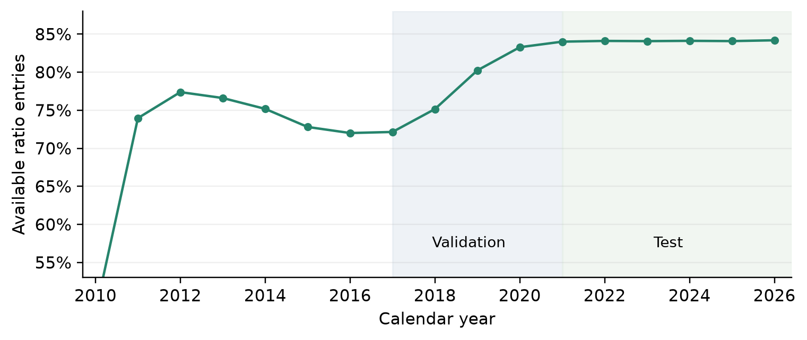
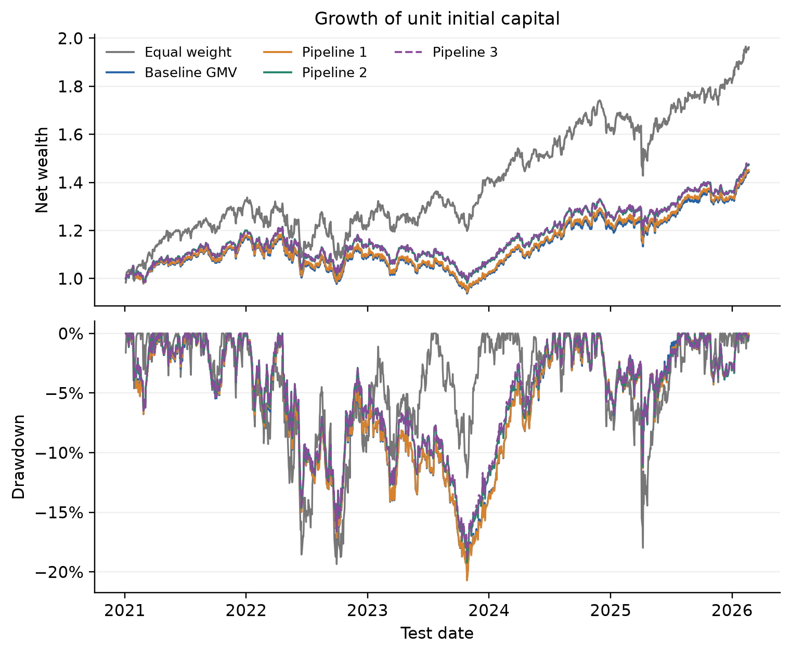
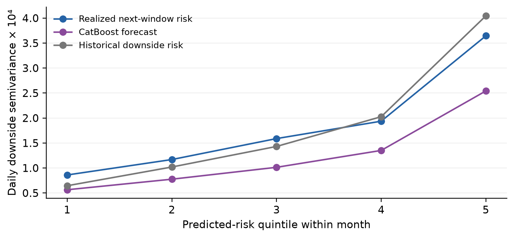

# Incremental information in minimum variance portfolio optimization

## Abstract

This study examines the incremental value of market regimes, corporate fundamentals and nonlinear risk forecasts in constrained equity portfolio optimization. A Ledoit–Wolf global minimum variance benchmark is extended sequentially with a two-state Gaussian hidden Markov model, a continuous business-quality penalty derived from dated SEC filings, and CatBoost forecasts of asset-level downside risk. All strategies share a fixed universe of 50 US equities, monthly rebalancing, a 15% target-weight cap and proportional transaction costs. New layer strengths are selected on 2017–2020 validation data; the main comparison covers 1,289 trading observations from January 2021 to February 2026. The regime model achieves the highest Sharpe ratio among optimized portfolios, increasing it from 0.733 to 0.774. The quality layer increases effective diversification from 11.59 to 17.12 assets and reduces annual turnover from 4.30 to 3.25, while lowering compound annual growth from 9.68% to 8.04%. CatBoost improves monthly risk-ranking correlation from 0.521 for a historical-risk forecast to 0.580, but reduces portfolio volatility by only 0.016 percentage points relative to the quality model. Explanatory controls show that generic diagonal regularization and historical downside risk can reproduce much of the observed allocation effect. Additional information therefore changes portfolio characteristics without establishing monotonic performance gains. The evidence is conditional on a survivorship-biased universe, idealized close execution and a test period previously exposed in the original baseline analysis.

Keywords: portfolio optimization; global minimum variance; hidden Markov model; corporate quality; CatBoost; downside risk; conditional value at risk.

## 1 Introduction

Portfolio selection is a joint allocation problem because the risk of a collection of securities depends on their dependence structure as well as their individual variability. The mean–variance framework formalized this principle and remains a useful starting point for comparing investment rules [1]. Its empirical application, however, requires uncertain inputs. A more elaborate risk model can improve an estimate while producing little practical benefit once constraints, trading costs and the sensitivity of optimized weights are taken into account.

This paper studies that distinction through an incremental information experiment. The starting point is a constrained global minimum variance portfolio, abbreviated GMV, estimated using Ledoit–Wolf shrinkage. Expected returns are not forecast. The first extension changes the covariance estimate using latent market states. The second adds a business-quality score constructed from financial statements available before portfolio formation. The third uses a nonlinear learner to forecast asset-level downside risk and adds that forecast to the same allocation problem. Equal weighting provides an additional, non-optimized reference.

Three questions organize the analysis. Does a regime-dependent covariance estimate improve realized portfolio risk relative to a stabilized unconditional estimate? Does an explicit fundamental-quality layer improve downside outcomes or the stability of allocations? Does broader information processed by CatBoost provide portfolio value beyond those two mechanisms? These questions concern observed incremental performance under a common protocol. They are not treated as hypotheses registered before any exposure to the evaluation sample.

The contribution is a transparent decomposition of the information-to-allocation chain. Both new layers recover the preceding pipeline at zero penalty strength; the investor constraints and accounting engine remain common. Forecast quality, portfolio performance and implementation characteristics are evaluated separately. Additional neutral-quality and historical-risk controls examine whether improvements reflect company information or simply the regularizing effect of a positive diagonal penalty.

The results are mixed. Regime information produces the strongest observed Sharpe ratio among optimized strategies. Quality regularization broadens allocations and lowers turnover but sacrifices return. CatBoost improves risk ranking relative to a historical forecast, while its incremental portfolio effect is small. This pattern motivates a qualified interpretation: model complexity must be evaluated at the decision level, and predictive improvement alone does not establish investment superiority.

## 2 Related literature and research position

Estimation error is a central difficulty in portfolio optimization. Ledoit and Wolf propose a well-conditioned covariance estimator obtained through linear shrinkage toward a scaled identity matrix [2]. Weight restrictions provide another source of stabilization: Jagannathan and Ma show why nonnegative constraints can reduce the risk of estimated portfolios even when the constraints are not justified by the population optimum [3]. These findings motivate a constrained shrinkage GMV benchmark rather than an unstable, unconstrained sample-covariance control.

Equal weighting remains a demanding reference. DeMiguel, Garlappi and Uppal compare optimized and naive allocations and document the difficulty of obtaining consistent out-of-sample improvements over 1/N after estimation error is considered [4]. In the present study, equal weighting shares the investment universe and trading assumptions with the optimized rules. It is used to contextualize the economic consequences of variance minimization, rather than to imply that the strategy with the highest realized return necessarily solves the risk objective best.

Latent-state models provide a way to represent changes in the distribution of economic and financial observations. Hamilton's regime-switching framework is a methodological antecedent [5], while Ang and Bekaert study asset allocation when volatility and correlation vary across regimes [6]. The model implemented here uses two Gaussian states fitted to market-summary features. It is a pragmatic covariance-adaptation mechanism, not a replication of either paper's economic model or dynamic utility optimization.

Corporate quality is economically distinct from recent price volatility. Profitability, financial safety and growth motivate the Quality Minus Junk literature [7]. Our score uses a narrower set of financial-statement ratios that can be constructed from the local SEC archive. It is an interpretable research measure with four equally weighted domains; it is not a reproduction of the published QMJ factor. Its influence on allocations is separated, where possible, from generic regularization.

CatBoost supplies a flexible regression model with native categorical-feature handling [8]. That capability does not by itself prevent time leakage in financial data. The chronology of feature availability and label maturity must still be enforced by the experiment. Similarly, an Amihud-style return-to-dollar-volume ratio supplies a tractable liquidity proxy [9], but including that proxy does not enforce trading capacity or model actual market impact.

Conditional value at risk is used to describe realized loss tails, drawing on the risk-measure literature [10]. It remains an evaluation criterion rather than the optimizer objective. The separation between development and evaluation follows the motivation of backtesting protocols for machine learning [11], while block resampling reflects serial dependence in portfolio returns [12]. Neither design choice removes the limitations of historical universe selection or prior exposure to the test sample.

## 3 Data and information availability

### 3.1 Price universe and chronological split

The price inputs are the three saved CSV files produced by the original price exploration notebook. They contain 50 US equity tickers selected for long, complete histories, with alphabetical ordering resolving ties. The resulting panel is concentrated in the early part of the ticker alphabet. It is a fixed research universe, not a reconstruction of historical S&P 500 constituents. Historical delistings and firms that failed the full-history criterion are absent, so survivorship and universe-selection bias remain.

Table 1 reports the unchanged sample split. The combined panel contains 6,573 price dates and 328,650 adjusted-price observations. Returns are calculated after joining the chronological splits, preserving the return from the last preceding close into the first validation or test date. No missing adjusted-price cells, duplicate date–ticker keys, non-finite prices or nonpositive prices occur in the supplied panel. An audit flags 271 stock-day simple returns with absolute magnitude above 20%; these observations are retained rather than winsorized. The audit is not an independent certification of every corporate-action adjustment.

Table 1 Price samples and their roles

{{table:splits}}

The adjusted-close field is used as supplied by the original Kaggle snapshot [13]. Additional high, low, close and volume observations come from version 1 of the same locally cached dataset. Every saved adjusted-price cell reconciles with that source within the code's absolute tolerance of 10^-10. This check establishes consistency between input files, not the accuracy of the provider's dividend or corporate-action treatment.

### 3.2 Corporate identities and financial facts

SEC Company Facts are keyed by Central Index Key, whereas the price panel is keyed by ticker. A saved SEC identity reference links all 50 tickers to issuer files [14]. Two legal reorganizations require documented predecessor identities: Apache before the APA holding-company structure and the predecessor BlackRock entity [15,16]. Their predecessor filings are excluded after the respective reorganization dates, preventing later subsidiary reports from being treated as parent-company information. No unverified predecessor bridge is imposed for BKR; its earlier observations can remain missing.

The extraction reads 52 issuer JSON files and retains filing date, accession number, economic period, XBRL concept and USD units. It excludes 43,870 invalid or nonannual-flow candidate rows and finds no ambiguous duplicate-value conflicts under the selected fact keys. After validity filtering and deduplication, 59,670 selected fact rows are available before dated snapshot construction. Only approved equivalent concepts are considered for each accounting measure, with an explicit priority order.

Each fact becomes eligible one business day after its filing date. A portfolio snapshot also requires that this availability date be no later than the actual previous exchange close. This second check handles exchange holidays that are not represented by a generic weekday calendar. Later filed amendments or restatements are not available to earlier snapshots. Nevertheless, an aggregate Company Facts archive downloaded today is not guaranteed to preserve every historical filing vintage; the procedure is an as-filed reconstruction subject to archive coverage.

Annual income and cash-flow quantities must span 330–400 days and originate in 10-K or 10-K/A filings. Quarterly and year-to-date flows are excluded. Annual flow ratios use assets or revenue at the matching fiscal-year end, while balance-sheet ratios use a common most recent eligible balance date. Most current ratio inputs are rejected when their economic period is more than 550 days old; revenue growth separately retrieves the preceding comparable annual revenue as a historical comparator. Nonpositive denominators yield missing values. No backward filling is performed.

### 3.3 Fundamental coverage and quality domains

Nine ratios are grouped into four domains, as shown in Table 2. Available values are transformed into cross-sectional percentile ranks on each formation date, using average ranks for ties and reversing the direction of adverse indicators. Missing evidence receives a neutral rank of 0.5. Ratios are equally weighted within each domain, and domains are equally weighted in the final score. This preserves all 50 securities and prevents missingness from automatically becoming a positive quality signal.

Table 2 Business quality indicators

{{table:quality}}

Average ratio coverage rises from 57.72% in 2010 to 83.44% in 2021, then is approximately 81.8–83.2% over the remaining test years. These percentages describe the fraction of available ratio entries across monthly company snapshots, not the fraction of companies with complete reports. Industrial-company ratios are less suitable or less available for some financial firms. Because ranks are not sector-neutral, quality exposure can partly reflect industry composition.

Figure 1. Annual means of the fraction of available ratios across monthly company snapshots. Missing ratios remain neutral in the score; a complete identity mapping does not imply complete accounting coverage.

## 4 Portfolio models

### 4.1 Common objective and benchmark

Let r_i,t denote the daily simple return of security i, and let w_t denote a vector of target weights. The common feasible set imposes full investment, long-only holdings and a 15% weight cap at rebalance. Between trades, weights may drift above that cap. The constrained problem is

<!-- equation:objective -->
$$
w_t^* = \arg\min_{w\in\mathcal W} w^\top\Sigma_t w,\qquad \mathcal W=\{w:\mathbf 1^\top w=1,\ 0\leq w_i\leq0.15\}.
$$

The equal-weight reference sets each target to 1/50. The main benchmark uses 252 strictly preceding return observations to estimate a centered Ledoit–Wolf covariance matrix. Specifically, the scikit-learn implementation shrinks the empirical covariance toward its average variance times the identity [2,17]:

<!-- equation:shrinkage -->
$$
\Sigma_t^{LW}=(1-\delta_t)S_t+\delta_t\mu_t I,\qquad \mu_t=\operatorname{tr}(S_t)/N.
$$

The shrinkage intensity is estimated from the available window. This scaled-identity estimator should not be confused with the constant-correlation target associated with other Ledoit–Wolf formulations. A common scalar normalization improves numerical optimization without changing the minimizer. The solver is SLSQP with analytic gradients, a 10^-12 tolerance and a maximum of 1,000 iterations. The completed run records no solver failures; the shared engine stops if a valid optimized solution is unavailable.

### 4.2 Pipeline 1 and market regimes

A two-state Gaussian hidden Markov model is refitted at each monthly formation date. Its inputs are the equal-weight market return, 20-session annualized market volatility, 63-session drawdown and 60-session average pairwise correlation. Standardization is fitted only on the preceding HMM window. The model uses at most 2,520 preceding feature observations and requires at least 756. Five initializations are evaluated, retaining the highest-likelihood converged fit under the library's convergence criterion; each permits up to 500 iterations. States are labelled calm and stress according to their weighted mean volatility, not the sign of market returns.

Historical state responsibilities are smoothed within the window available at that formation date. This is permissible for estimating the current covariance, because no subsequent trading observations enter the fit. It must not be interpreted as the state classification that would have been known at each earlier historical date. At the last observation, the state posterior provides the current probability vector. The transition matrix projects this vector forward and the 21 successive one-step forecasts are averaged:

<!-- equation:probability -->
$$
\bar p_t=\frac{1}{21}\sum_{h=1}^{21}p_{t-1}A_t^h.
$$

State-weighted covariance matrices are estimated from the same 252-session return window used by the baseline. The weighted covariance denominator is the sum of state weights minus the sum of their squares divided by their sum. Effective sample size and the pooling coefficient are

<!-- equation:effective -->
$$
n_{k,t}^{eff}=\frac{(\sum_s\gamma_{s,k})^2}{\sum_s\gamma_{s,k}^2},\qquad a_{k,t}=\frac{n_{k,t}^{eff}}{n_{k,t}^{eff}+N}.
$$

Pooling protects states with limited effective history. The forecast risk matrix combines each state estimate with the global shrinkage matrix and then averages the results using projected probabilities:

<!-- equation:regime -->
$$
\Sigma_t^R=\sum_{k=1}^{2}\bar p_{k,t}\left[a_{k,t}S_{k,t}+(1-a_{k,t})\Sigma_t^{LW}\right].
$$

The main specification excludes the between-state mean term and therefore is a within-state covariance mixture rather than the complete covariance of a return-distribution mixture. Symmetrization and a small scale-relative eigenvalue floor maintain positive definiteness. The retained settings come from the existing Pipeline 1 specification; alternative HMM state counts, lookbacks and feature sets are not newly searched on the final test.

### 4.3 Pipeline 2 and business quality

The quality score q_i,t lies between zero and one. Let R_i,j,t be the favorable-direction rank of ratio j, with 0.5 assigned to missing values, and let D_d denote the indicators of domain d. The four-domain score is

<!-- equation:quality -->
$$
q_{i,t}=\frac{1}{4}\sum_{d=1}^{4}\frac{1}{|D_d|}\sum_{j\in D_d}R_{i,j,t}.
$$

Pipeline 2 replaces the regime risk matrix with a regularized matrix:

<!-- equation:qualitymatrix -->
$$
\Sigma_t^Q=\Sigma_t^R+\lambda\,m_t\operatorname{diag}(1-q_t),\qquad m_t=\operatorname{median}(\operatorname{diag}(\Sigma_t^R)).
$$

The added quadratic term penalizes concentrated positions more strongly when the issuer has lower observed quality. It does not estimate an expected return or a calibrated default probability. The multiplier m_t makes the penalty scale with the current daily covariance level, while the nonnegative strength lambda controls its influence. Setting lambda to zero exactly recovers Pipeline 1.

Even a constant quality score adds a positive diagonal penalty, so increased diversification alone cannot establish that company rankings add information. A neutral-score control is therefore reported as an explanatory diagnostic. The experiment tests the chosen score and penalty together; it does not identify an industry-independent causal effect of business quality.

### 4.4 Pipeline 3 and downside risk forecasts

CatBoost predicts how an individual stock's next 21-session downside semivariance differs from its trailing 63-session value. Downside semivariance is the mean squared negative simple return, using all sessions in the relevant window. Values are floored at 10^-10 before taking logarithms. Denote the trailing value by D_i,t^- and the next-window value by D_i,t^+. The regression target and transformed forecast are

<!-- equation:target -->
$$
y_{i,t}=\log(D_{i,t}^{+}/D_{i,t}^{-}),\qquad \widehat D_{i,t}=D_{i,t}^{-}\exp(\operatorname{clip}(f_t(x_{i,t}),-3,3)).
$$

The predictor is fitted to squared error in the log-risk-ratio target. Its exponentiated output is a conditional log-risk score scaled by recent risk. It is not an unbiased forecast of conditional mean semivariance; the distinction matters for the calibration results. The bounds on the predicted log ratio are fixed before model selection.

The full model contains 46 numeric inputs and ticker as a categorical input, for 47 features in total. Table 3 summarizes the blocks. Market-return proxies are calculated from the supplied 50-stock panel rather than from an independent market index. Numeric missing values are passed to CatBoost; no normalization using the full future panel is applied.

Table 3 CatBoost information blocks

{{table:features}}

Pipeline 3 adds a nonnegative diagonal risk forecast to the quality-adjusted matrix:

<!-- equation:mlmatrix -->
$$
\Sigma_t^C=\Sigma_t^Q+\eta\operatorname{diag}(\widehat D_t).
$$

At eta equal to zero it exactly recovers Pipeline 2. Off-diagonal covariance entries come from the regime model; diagonal penalties also change the implied correlations. The forecast modifies asset-specific risk penalties; it does not learn the covariance matrix, maximize a return forecast or generate unconstrained portfolio weights.

## 5 Experimental protocol and evaluation

### 5.1 Validation selection and annual learning

Monthly learning snapshots start in January 2010. The complete panel contains 9,700 company-month rows over 194 formation dates, including incomplete future labels at the end of the dataset. For each evaluation year, CatBoost is fitted once at the first formation date using an expanding history. A training observation is admitted only if both its formation date and the end of its 21-session target window precede the fit date. Targets crossing the cutoff are purged. Rows are ordered by date and ticker, and has_time is enabled to preserve input-order handling [18]. This configuration is not described as a guarantee of a particular boosting_type default.

The first validation model uses available matured observations from 2010–2016. Later validation models may learn from completed earlier validation history. The first test model can use completed train and validation observations; annual refits during test may learn from already matured earlier test observations. This is an adaptive, fixed-algorithm evaluation, not a model trained once and left unchanged for six years. Future labels and test-dependent hyperparameter selection are excluded.

Five quality strengths are compared: 0, 0.25, 0.5, 1 and 2. The ML search compares depths 4 and 6 with strengths 0, 0.25, 0.5 and 1, counting the duplicate no-ML control once. All CatBoost models use 300 trees, learning rate 0.04, L2 leaf regularization 10, seed 20260906 and two threads. Early stopping on the test period is not used. Quality selection precedes ML selection, and the selected quality strength is held fixed during the ML search.

Candidates are ranked using a weighted validation score: annual volatility 30%, daily CVaR95 25%, maximum drawdown 20%, annual turnover 10%, average HHI 10% and Sharpe 5%. Lower values are favored except for Sharpe. Each criterion uses average ranks among candidates, and ties favor smaller intervention and then shallower trees. The selected values are lambda = 1, eta = 0.25 and depth = 4. This score makes diversification and trading stability explicit objectives; selecting a model does not imply that it minimizes validation CVaR alone.

### 5.2 Portfolio accounting and implementation assumptions

All portfolios rebalance on the first observed session of each month and start each reported evaluation split from cash. A target formed from preceding closes is charged the initial investment cost and earns the formation session's return. Signals therefore precede the return they earn, but execution at the same previous close used to form the signal is idealized. A later-open or next-close implementation is a separate experiment, not an assumption already tested here.

Let w_t^- denote the pre-trade weights and w_t^* the selected target. Two-sided turnover is the sum of absolute differences between them. It equals one on initial investment and counts both purchases and sales on later rebalances. At the base cost rate c = 0.001, net returns and subsequent drifting weights satisfy

<!-- equation:accounting -->
$$
\tau_t=\sum_i|w_{i,t}^*-w_{i,t}^-|,\qquad r_{p,t}^{net}=(1-c\tau_t)(1+r_{p,t}^{gross})-1.
$$

<!-- equation:drift -->
$$
r_{p,t}^{gross}=\sum_iw_{i,t}r_{i,t},\qquad w_{i,t+1}^{-}=\frac{w_{i,t}(1+r_{i,t})}{1+r_{p,t}^{gross}}.
$$

Here w_i,t is the target on a rebalance date and the carried pre-trade holding otherwise; turnover is zero on non-rebalance dates. Commissions reduce portfolio capital multiplicatively. The rule is a proportional-cost research convention, not a full cash-and-lot execution simulator. The sum of daily cost fractions is reported as a diagnostic and should not be read as the exact compounded loss of terminal wealth. Terminal liquidation, market impact, capacity limits, taxes, financing and cash yield are not modeled. No explicit turnover or liquidity constraint is imposed.

The common engine corrects two inconsistencies in the earlier notebooks: fixed target weights had been used for daily returns despite drift being used for turnover, and the Pipeline 1 Sortino denominator differed from the baseline's. Initial-wealth drawdown and cost compounding are also standardized. All tables in this article use the corrected engine; earlier manuscript figures are superseded. The inherited window, cap and schedule are held fixed rather than reoptimized after that correction.

### 5.3 Performance measures and uncertainty

Net simple returns are compounded into wealth with initial capital one. CAGR uses 252 sessions per year. Annual volatility is the sample standard deviation of daily returns multiplied by the square root of 252. Sharpe is annualized arithmetic mean divided by annual volatility, with the risk-free rate fixed at zero. Sortino instead uses annualized root-mean-square negative returns relative to a zero target. Thus the reported ratios are not excess-return measures relative to an observed Treasury bill series.

Maximum drawdown is the largest proportional decline from the running wealth peak, including initial capital. VaR at confidence alpha is the empirical alpha quantile of daily loss, where loss is the negative net return. The reported empirical CVaR is the mean of observations at or above that threshold:

<!-- equation:cvar -->
$$
L_t=-r_{p,t}^{net},\qquad \widehat{CVaR}_{\alpha}=\frac{\sum_tL_t\mathbf1\{L_t\geq\widehat{VaR}_{\alpha}\}}{\sum_t\mathbf1\{L_t\geq\widehat{VaR}_{\alpha}\}}.
$$

VaR and CVaR are daily loss magnitudes, not annualized statistics. Annual turnover is total two-sided traded fraction divided by the evaluation length in trading years. HHI is the sum of squared target weights; effective breadth is its reciprocal, averaged across rebalances. Active positions, maximum target weight, target-to-target L1 changes, drawdown duration and solver diagnostics supplement these measures.

Forecast diagnostics use complete 21-session labels: 3,050 stock-month observations across 61 test formation dates. The final February 2026 formation lacks a complete target and is excluded from forecast diagnostics, while all 1,289 test sessions and 62 rebalances remain in portfolio performance. Log-risk RMSE compares predicted and realized log semivariance. Rank IC is Spearman correlation across stocks within each month, averaged across months.

Incremental performance uncertainty is assessed with 2,000 paired moving-block bootstrap draws, using identical resampled dates for both strategies. Contiguous blocks of 10, 20 and 60 sessions are sampled with replacement and concatenated to the original sample length. Percentile 95% intervals describe conditional variation for the selected return paths. They do not account for the full model search, multiple comparisons, parameter re-estimation within each draw or universe-selection bias. Drawdown intervals are especially sensitive to synthetic block ordering [12].

## 6 Empirical results

### 6.1 Validation development results

Table 4 reports the development-sample performance of the selected configurations. Pipeline 1 has the strongest Sharpe among optimized models but slightly higher volatility than the baseline. The quality layer lowers volatility and turnover relative to Pipeline 1 while worsening CVaR95 and maximum drawdown on validation. The weighted selection score nevertheless chooses a positive quality strength because it also rewards diversification and trading stability. These observations are selection evidence and should not be counted as an independent confirmation of superiority.

Table 4 Validation performance after costs from 2017 to 2020

{{table:validation}}

### 6.2 Main test comparison

Table 5 presents the common test results. Equal weighting produces the largest CAGR, 12.11%, accompanied by 16.85% annual volatility and 20.72% maximum drawdown. The baseline GMV portfolio reduces volatility to 13.15% and drawdown to 18.63%, with CAGR of 9.16%. This illustrates the distinction between a realized return ranking and the purpose of a minimum-variance allocation.

Table 5 Test return and risk after costs from 2021 to February 2026

{{table:test}}

Pipeline 1 increases CAGR to 9.68% and Sharpe to 0.774, compared with 0.733 for the baseline. Volatility declines by 0.104 percentage points, CVaR95 by 0.017 percentage points and maximum drawdown by 0.396 percentage points. These are modest changes in risk magnitudes. Figure 2 shows the compounded paths and drawdowns, including the close proximity of the two newest pipelines.

Figure 2. Net wealth and drawdown use the same 10 bps cost convention and daily drifting holdings. Pipeline 2 and Pipeline 3 largely overlap. The 2026 segment ends on February 20.

Pipeline 2 changes allocation structure more strongly than aggregate risk. Its effective breadth rises to 17.12 from 11.59, and annual turnover falls to 3.25 from 4.30. Average portfolio quality also increases. However, CAGR falls to 8.04% and Sharpe to 0.656. Volatility is slightly higher than Pipeline 1, and CVaR99 rises from 2.835% to 2.881%. Smaller CVaR95 and drawdown therefore do not establish general downside dominance.

Table 6 Test allocation and implementation characteristics

{{table:implementation}}

N/V denotes an exposure not verified against the retained rebalance diagnostics. The equal-weight summary reports 0.507, but its detailed export contains a neutral 0.500 placeholder; the disputed value is withheld here. The other test quality exposures reconcile with their detailed exports. This reporting discrepancy does not change portfolio weights, returns or risk metrics.

Pipeline 3 retains approximately the same CAGR as Pipeline 2 while lowering annual volatility from 13.100% to 13.084%. CVaR95 decreases from 1.8354% to 1.8330%, and maximum drawdown from 17.8826% to 17.7791%. Effective breadth increases to 17.63 and turnover decreases to 3.18. The observed incremental portfolio effect is economically small even where its direction is favorable.

### 6.3 Forecast accuracy and information ablations

CatBoost improves log-risk RMSE relative to the trailing downside-risk forecast, from 0.952 to 0.884, and mean monthly rank IC from 0.521 to 0.580. This establishes useful relative forecasting information on the evaluated dates, subject to the common sample limitations. It does not establish superiority over every simpler learned model or guarantee an improvement in optimized wealth.

Table 7 Test forecast accuracy for complete monthly labels

{{table:prediction}}

Feature ablations keep the selected depth and ML penalty fixed. Every ablation retains the explicit Pipeline 2 quality penalty, so removing fundamental features from CatBoost does not remove all fundamental information from the portfolio. The price-and-regime model has lower log-risk RMSE than the full model, while the full model has a slightly higher mean rank IC. Adding fundamental inputs alone does not improve the reported forecast metrics over the price-and-regime version. Broader information therefore has a metric-dependent rather than uniformly positive effect.

Table 8 CatBoost feature ablation with fixed allocation settings

{{table:ablation}}

The most influential full-model inputs are market correlation, stress probability, drawdown and recent downside risk. These importance values are descriptive summaries of fitted trees, not causal effects; correlated features can substitute for each other. The calibration plot shows systematic differences between predicted and realized absolute risk. In particular, exponentiating a log-risk prediction need not recover mean risk. Calibrating this transformation on a future training and validation design is a plausible extension, not a correction fitted on the current test.

Figure 3. Stocks are assigned to predicted-risk quintiles within each month, then group outcomes are averaged. The plot assesses calibration on complete test labels and does not define a trading rule selected from those groups.

### 6.4 Uncertainty and implementation sensitivity

Table 9 reports the 20-session block intervals for sequential model differences. The volatility reduction from the baseline to Pipeline 1 excludes zero, as does the much smaller reduction from Pipeline 2 to Pipeline 3. Their signs also persist with 10- and 60-session blocks. The favorable changes in CVaR95 and maximum drawdown do not exclude zero under these checks. The Pipeline 2 minus Pipeline 1 Sharpe interval includes zero with 10- and 20-session blocks but is negative with 60-session blocks, reinforcing the sensitivity of statistical conclusions to the dependence assumption.

Table 9 Incremental test differences with paired bootstrap intervals

{{table:bootstrap}}

Trading-cost sensitivity holds gross returns and target paths fixed and recomputes net returns at 0, 10, 25 and 50 bps. At 50 bps, the baseline CAGR is 7.76% and Pipeline 1 CAGR is 7.80%, much closer than at 10 bps. The lower-turnover quality and CatBoost portfolios retain CAGRs of approximately 6.64% and 6.67%. Lower turnover reduces implementation drag but does not offset their lower gross return on this sample.

Table 10 CAGR sensitivity to proportional trading costs

{{table:costs}}

An additional one-month delay in the already dated quality score provides a publication-lag sensitivity check, with the primary strength unchanged. Annual and formation-regime summaries are also saved with the experiment. The 2026 annual row contains a partial-year return, not an annualized full-year performance estimate. Regime-conditioned results group sessions by the probability known at their monthly formation date and should not be interpreted as retrospectively optimal timing rules.

### 6.5 Explanatory regularization controls

The neutral-quality and historical-risk controls were introduced after the main evaluation to explain mechanisms. They do not alter the frozen primary settings and are not independent confirmatory tests. Setting every quality score to 0.5 produces effective breadth of 17.70 and CAGR of 7.99%, close to the quality model's 17.12 and 8.04%. The actual quality score improves CVaR95 relative to this neutral control but has a larger maximum drawdown. Much of the breadth change is therefore compatible with generic diagonal regularization.

Replacing CatBoost's risk forecast with trailing downside semivariance at the same ML strength yields CAGR of 8.06%, volatility of 13.064% and maximum drawdown of 17.587%. These values are competitive with, and on these measures slightly better than, the learned-risk version. The comparison does not establish a universally better historical-risk model, but it prevents attributing all benefits of an added diagonal term to machine learning.

## 7 Discussion and limitations

The experiment separates three mechanisms that are often combined in a single complex allocation model. Regime adaptation changes the estimated dependence structure. Fundamental quality changes the cost of concentration in particular issuers. CatBoost adds a forecast of marginal downside risk. The mechanisms can affect different dimensions of the portfolio, and the validation criterion explicitly values diversification and turnover in addition to return and tail risk. A strategy selected under this criterion need not maximize test Sharpe or CAGR.

The strongest observed optimized Sharpe belongs to the regime model, but its higher turnover makes the result sensitive to implementation cost. Quality regularization substantially changes breadth and turnover, yet the neutral-score control indicates that this effect is not uniquely attributable to fundamentals. The ML layer improves a historical risk forecast but has only limited influence on the constrained solution. A strong existing covariance model, common concentration restrictions, correlated input signals and the modest selected penalty are plausible explanations; the current controls do not causally identify their separate contributions.

Several limitations constrain generalization. First, the fixed 50-stock universe is small, alphabetically concentrated and selected using long complete histories. It cannot support claims about an unbiased US market universe, historical index membership or emerging markets. Second, the test sample was previously visible in the original baseline notebook. New hyperparameters were selected without test optimization, but the complete research process is not a pristine preregistered holdout experiment. The comparison is an exploratory extension of an existing study.

Third, the price provider's adjustment conventions have not been independently reconciled with dividends, splits and delisting proceeds. Fourth, financial-statement reconstruction relies on a current aggregate archive, imperfect concept coverage and issuer identity links. The filing embargo prevents obvious future-report leakage but does not certify a complete immutable point-in-time database. Industry-specific financial ratios and historically appropriate sector classifications remain an important extension.

Fifth, trading at the close that supplies the latest signal is idealized. Fixed proportional costs omit intraday execution, market impact, minimum lots, taxes and portfolio capacity. Sixth, Sharpe and Sortino use zero benchmark rates; comparison with cash or a risk-free asset would require an additional dated rate series. Seventh, CVaR99 is based on only about 13 test-tail observations, and maximum drawdown is highly path-dependent. Both are uncertain summaries of a single realized sample.

Finally, the model search is deliberately compact and does not vary every covariance window, HMM state definition or allocation objective. The two-state labels are descriptive, Gaussian emissions simplify extreme behavior, and the covariance mixture omits between-state mean variation. The ML target and squared-error loss are not optimized directly for portfolio utility. A nested chronological validation design on a broader historical universe, followed by an untouched forward period, would provide a stronger next test than further tuning against the present evaluation window.

## 8 Conclusion

Adding market regimes, company fundamentals and machine learning does not produce a sequence of universally superior portfolios in this experiment. The regime-aware model delivers the best observed Sharpe among optimized strategies and modestly lower volatility than the shrinkage GMV baseline. The quality layer increases diversification and reduces turnover while lowering return. CatBoost improves individual risk forecasts relative to a historical comparator, but its marginal portfolio benefit is small and a simple historical-risk penalty remains competitive.

The practical implication is to evaluate additional information at several distinct stages: its historical availability, its predictive content, its effect on feasible weights and its realized value after implementation costs. On the supplied sample, transparent controls and consistent accounting are more informative than a claim that complexity must win. The findings support further investigation of regime adaptation and quality-based regularization while leaving broad investment superiority unestablished.

## Data and code availability

The accompanying repository contains the executed English-language notebooks, shared implementation, validation grids, dated predictions, allocation paths, metric tables and frozen run metadata: https://github.com/melnikovknst/Invest-Portfolio-Optimization. Raw price files, the SEC archive, local environments and disposable caches are excluded from version control. Their expected locations, source identity and hashes are documented so that users with the same local inputs can reproduce the analysis. The repository does not redistribute a complete historical constituent database. The article tables are generated from the saved experiment outputs and all reported main results use the corrected common accounting engine.

## References

{{references}}

## Appendix A Fixed implementation settings

Table A1 Settings retained in the reported experiment

{{table:settings}}

## Appendix B Reproduction and interpretation checks

The original experiment at repository commit 93676de retained five executed notebooks: 52 code cells, 21 embedded figures and 60 HTML table outputs, with no execution errors. Its recorded eight unit and temporal tests passed, zero-strength controls recovered the preceding pipeline, and that commit's mathematical source hashes match the frozen specification. These are records of the original run, not a claim that subsequently edited code has been re-executed.

A subsequent repository review reconciled all 16 retained strategy–split result folders, including accounting, weight constraints and metric calculations; maximum metric discrepancy was below 5 × 10^-14. Validation selection, forecast summaries, cost and annual summaries, and all 15 paired-bootstrap comparison–block combinations were also recomputed from saved evidence. Four benchmark quality-exposure summaries disagree with neutral placeholders in detailed exports: three validation controls and test equal weighting. Those original files are retained for provenance, and the disputed article entry is withheld in Table 6. Reconstructing measured monthly exposure requires the original SEC snapshots.

The reviewed implementation adds calendar-alignment checks, missing-issuer handling, asset-aware cache fingerprints, protected benchmark exports and explicit failure status. Offline tests include synthetic HMM and CatBoost future-information perturbations. The original raw inputs were unavailable in the review checkout, so the two real-data integration checks and a full economic rerun could not be repeated. Current source hashes intentionally differ from the historical freeze; no new test performance is claimed. The review supplements, rather than replaces, the original experiment and does not remove its economic or data limitations.

The primary comparison notebook recomputes performance from stored daily paths and target weights before presenting the tables. The run manifest records input fingerprints, selected settings and completed notebook execution. Any future change to economic code or source inputs requires renewed validation, a new frozen specification and regenerated outputs. Presentation edits alone do not constitute a new experiment. A complete rerun begins with the experiment driver, then executes all notebooks, runs the tests and rebuilds this article from the saved results.
